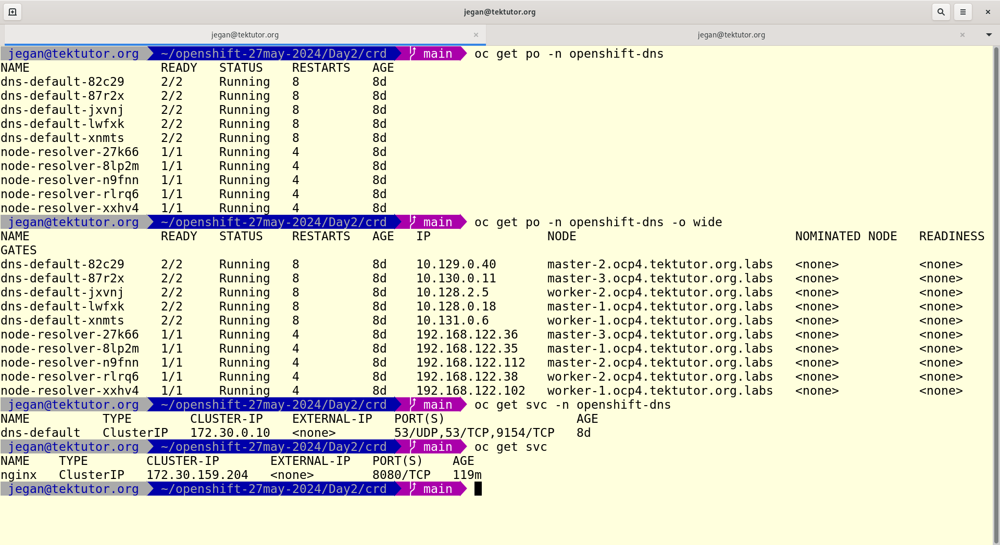
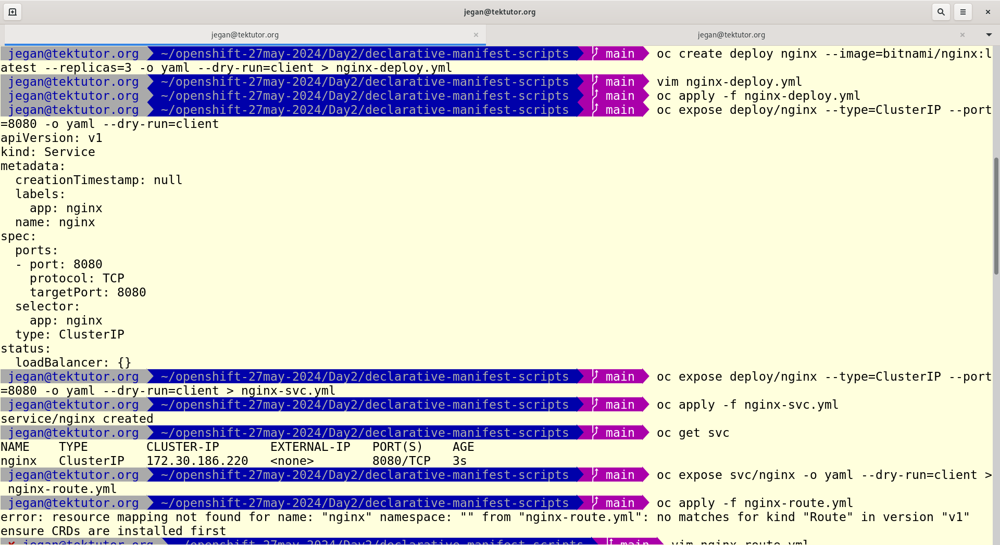
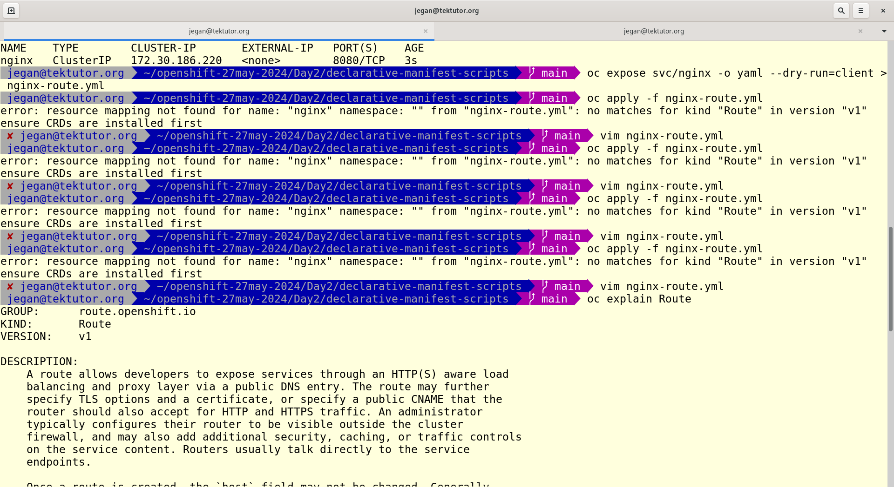
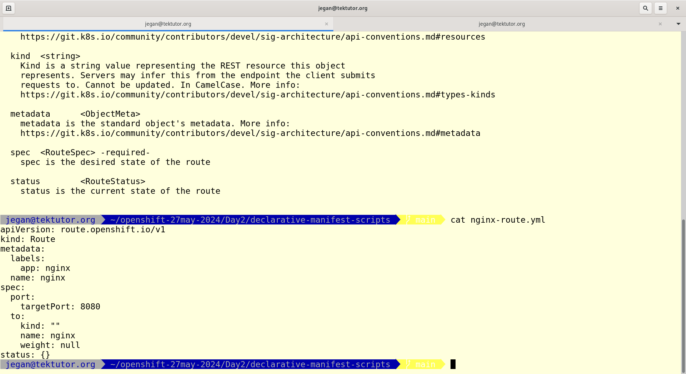
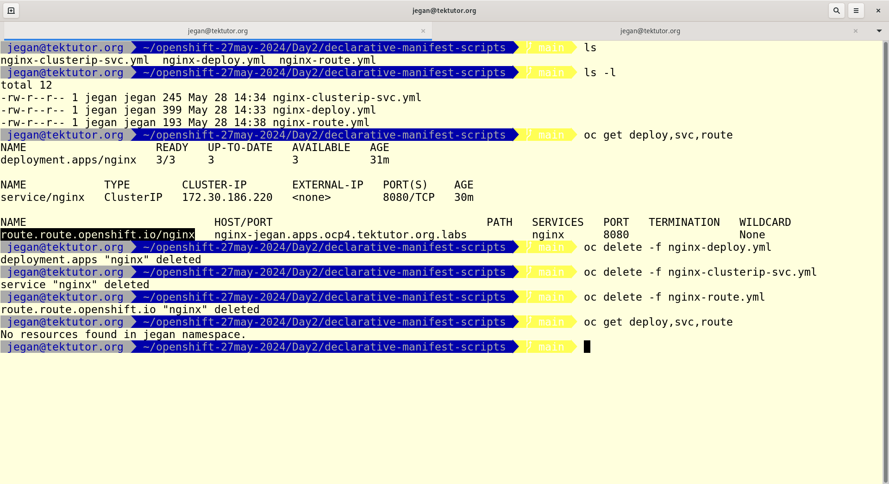
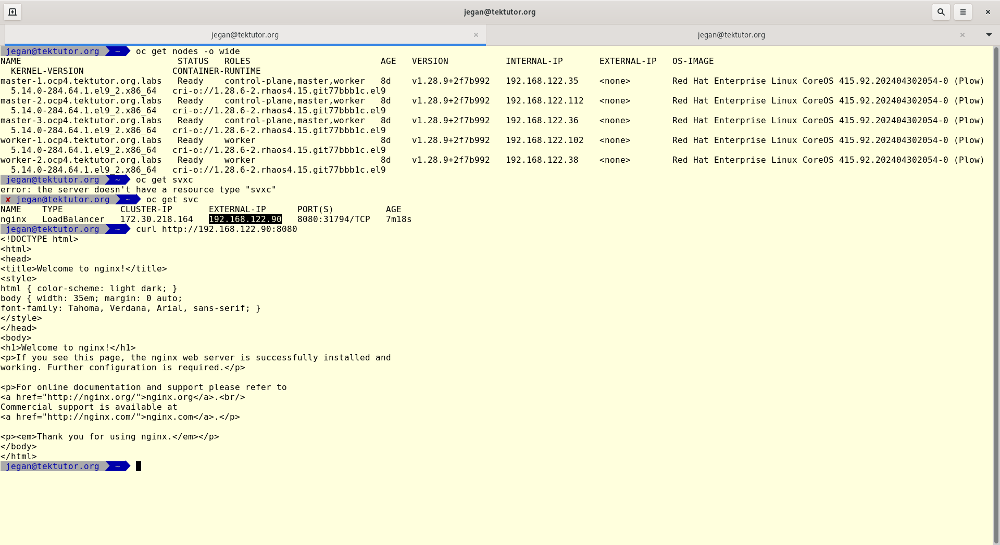

# Day 2

## Lab - Login to OpenShift cluster from CLI
```
oc version
kubectl version
oc login -u kubeadmin https://api.ocp4.tektutor.org.labs:6443
```

Expected output
<pre>
jegan@tektutor.org $ oc version
Client Version: 4.15.12
Kustomize Version: v5.0.4-0.20230601165947-6ce0bf390ce3
Server Version: 4.15.12
Kubernetes Version: v1.28.9+2f7b992
  
jegan@tektutor.org $ kubectl version
Client Version: v1.28.2
Kustomize Version: v5.0.4-0.20230601165947-6ce0bf390ce3
Server Version: v1.28.9+2f7b992
  
jegan@tektutor.org $ oc login -u kubeadmin https://api.ocp4.tektutor.org.labs:6443
Console URL: https://api.ocp4.tektutor.org.labs:6443/console
Authentication required for https://api.ocp4.tektutor.org.labs:6443 (openshift)
Username: kubeadmin
Password: 
Login successful.

You have access to 74 projects, the list has been suppressed. You can list all projects with 'oc projects'

Using project "jegan".  
</pre>

## Lab - Scale up/down nginx deployment
```
oc get deploy,po
oc scale deploy/nginx --replicas=5
oc get po -w
oc get po
oc scale deploy/nginx --replicas=3
oc get po -w
oc get po
```

Expected output
<pre>

</pre>

## Lab - Rolling update ( upgrade nginx deploy image version )

Delete the existing nginx deployment before proceeding
```
oc delete deploy/nginx
```

You can now deploy nginx version 1.18
```
oc project
oc create deployment nginx --image=bitnami/nginx:1.18 --replicas=3
oc get rs,po
```

Now you can edit the nginx deployment and replace the nginx image version from bitnami/nginx:1.18 to bitnami/nginx:1.19 and save it
```
oc edit deploy/nginx
oc get rs,po
```


Check the status of the rolling update
```
oc rollout status deploy/nginx
```

Rolling back to previous version ( i.e from 1.19 to 1.18 )
```
oc rollout undo deploy/nginx
```

Let's upgrade nginx to version 1.20
```
oc set image deploy/nginx nginx=bitnami/nginx:1.20
oc get po
oc describe deploy/nginx
```

Rolling back to any specific old revision
```
oc rollout undo deploy/nginx --to-revision=1
```

## Info - What happens when we issue the below command
```
oc create deployment nginx --image=bitnami/nginx:latest --replicas=3
```

These are the chain of things that happens when we issue the above command
```
- oc client tool will make a REST call to API Server requesting it to create a deployment with name nginx using image bitnami/nginx:latest with 3 Pod instances
- API Server receives the REST call from oc client tool, it then creates a deployment yaml record in the etcd database
- API Server then sends a broadcasting event to notify that a new deployment is created
- Deployment Controller receives the new deployment created event, it then makes a REST call to API Server requesting to create a ReplicaSet for the nginx deployment
- API Server receives the request from deployment controller, it then creates a ReplicaSet yaml record in the etcd database
- API Server then sends a broadcasting event to notify that a new replicaset is created
- ReplicaSet controller receives the new replicaset created event, it then makes REST call to create 3 Pods
- API Server receives the REST call from ReplicaSet controller, it then creates 3 Pod yaml records in the etcd database
- API Server then sends a broadcasting event to notify that new Pods are created
- Scheduler receives the new Pod created events, it then finds a healthy node where specific pods can be deployed
- Scheduler makes REST call to API server with its scheduling recommendations for each new Pods
- API Server receives the scheduling recommendation from Scheduler, it retrieves the existing Pod record from etcd database and then it updates the scheduling recommendation it received from SCheduler
- API Server then sends broadcasting event for each Pod to notify that Pod is scheduler to a specific node
- kubelet container running that runs on the specific node receives the event from API Server, it then pulls/downloads the container image, it creates container and starts the container.
- kubelet updates the status of the Pod containers to the API Server via REST calls
- API Server receives the status from kubelet, it then retrieves the respective record from etcd database it then updates the Pod status
- kubelet on each node keeps monitoring the container status and it keeps reporting their status to API Server via REST calls
- API Server udpates the status of the Pod as it receives the status from respective kubelet running on each node
```

Find more details about deployment,replicaset, pod
```
oc describe deploy/nginx
oc describe rs/nginx-566b5879cb
oc describe pod/nginx-6b49c75d9-xsh5t
```

## Info - What is OpenShift Operator?
```
- collection of many custom resources and custom controllers
- custom resources can be added by defining Custom Resource Definitions (CRD)
- to manage the Custom Resources, we also have to provide Custom Controllers
```

## Accessing the ClusterIP Service

ClusterIP Service is an internal service, hence we can only access from with the cluster i.e from some pod we can access.

In order access the nginx clusterip internal service, let's create a test pod
```
oc create deploy test --image=tektutor/spring-ms:1.0
oc get po
oc rsh deploy/test
curl http://<service-name>:<service-port>
curl http://nginx:8080
curl http://<service-ip>::<service-port>
curl http://172.30.159.204:8080
```

#### About Service Discovery
In openshift, one DNS Pod per node is deployed by default as a Daemonset.  When pod container is created by kubelet container agent, it configures the /etc/resolv.conf file to point to the default dns of kubernetes.  The DNS service is normally 172.30.0.10 is configured in all the pods.  The DNS Pod helps in resolving the service name to its respective IP address.

Listing the dns pods in openshift
```
oc get po -n openshift-dns
```

Listing the dns service 
```
oc get svc -n openshift-dns
```

Expected output


## Lab - Declaratively creating a deployment
```
oc create deploy nginx --image=bitnami/nginx:latest --replicas=3 -o yaml --dry-run=client
oc create deploy nginx --image=bitnami/nginx:latest --replicas=3 -o yaml --dry-run=client > nginx-deploy.yml
oc apply -f nginx-deploy.yml
oc get deploy,rs,po
```

Expected output


## Lab - Declaratively creating an internal clusterip service
```
oc expose deploy/nginx --type=ClusterIP --port=8080 -o yaml --dry-run=client 
oc expose deploy/nginx --type=ClusterIP --port=8080 -o yaml --dry-run=client > nginx-clusterip-svc.yml
oc apply -f nginx-clusterip-svc.yml
oc get svc
oc describe svc/nginx
```
Expected output


## Lab - Declaratively creating an external route with public url

After generating the nginx-route.yml edit the file and make sure the apiVersion appears as route.openshift.io/v1
```
oc expose svc/nginx -o yaml --dry-run=client
oc expose svc/nginx -o yaml --dry-run=client > nginx-route.yml
oc explain route
oc apply -f nginx-route.yml
oc get route
```
Expected output





## Lab - Declaratively deleting deployment, service and route
```
oc delete -f nginx-deploy.yml
oc delete -f nginx-clusterip-svc.yml
oc delete -f nginx-route.yml

oc get deploy,svc,route
```

Expected output



## Lab - Declaratively creating nodeport and loadbalancer external services
```
oc delete -f nginx-clusterip-svc.yml
oc expose deploy/nginx --type=NodePort --port=8080 -o yaml --dry-run=client
oc expose deploy/nginx --type=NodePort --port=8080 -o yaml --dry-run=client > nginx-nodeport-svc.yml
oc expose deploy/nginx --type=LoadBalancer --port=8080 -o yaml --dry-run=client > nginx-lb-svc.yml
ls -l
```

Let's create the nodeport external service
```
oc apply -f nginx-nodeport-svc.yml
oc get svc
```

Lets access the nodeport service
```
oc get nodes
curl http://master-1.ocp4.tektutor.org.labs:30515
curl http://master-2.ocp4.tektutor.org.labs:30515
curl http://master-3.ocp4.tektutor.org.labs:30515
curl http://worker-1.ocp4.tektutor.org.labs:30515
curl http://worker-2.ocp4.tektutor.org.labs:30515
```

## Lab - Creating a load balancer service declaratively

#### Things to note
```
- As Load Balancer service is meant for public cloud environments like AWS, Azure, GCP, Digital Ocean, etc.,
- It won't work out of the box in an on-prem openshift setup like our lab setup.
- Hence we need to install MetalLB Operator( it is already installed on your lab environment but needs to be configured )
```

For configuring Metallb operator, you can refer my medium blog
<pre>
https://medium.com/tektutor/using-metallb-loadbalancer-with-bare-metal-openshift-onprem-4230944bfa35  
</pre>


Let's create a load balancer service
```
oc delete -f nginx-nodeport-svc.yml
oc apply -f nginx-lb-svc.yml
oc get svc
```

Accessing the load balancer service
```
curl http://192.168.122.90:8080
```

Expected output

