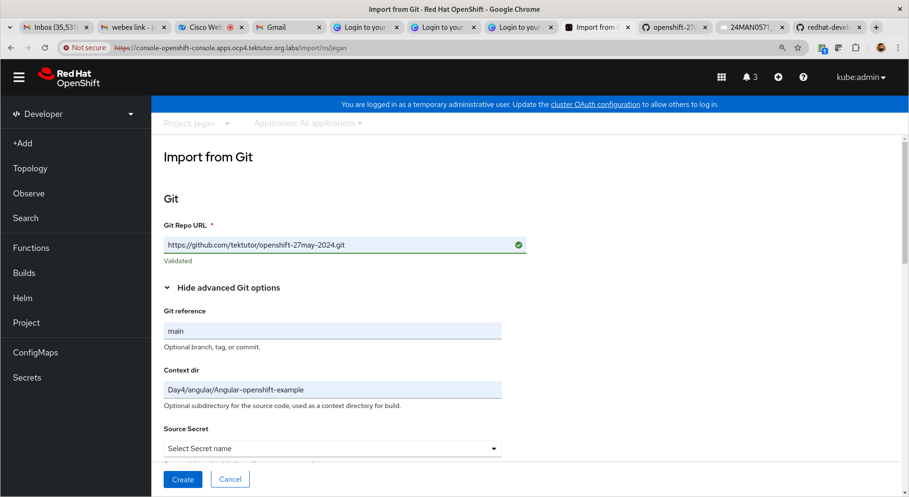
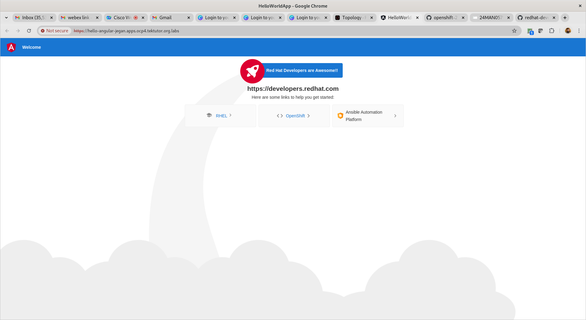
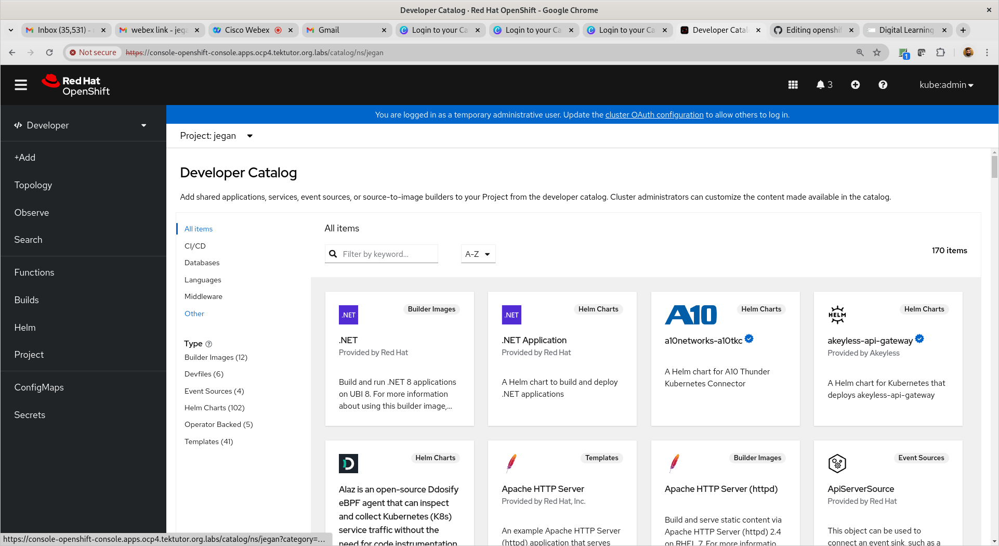

# Day 4

## Info - How to see the values stored inside etcd database?

## Info - What is an Openshift Job?
- any one time activity we can create them as a Job
- Example
  - delete all Persistent Volume which are unused
  - taking backup of etcd database

## Info - What is an Openshift CronJob?
- any recurring activity but that will run for few minutes and terminate we can run them as a CronJob
- Example
  - taking backup of etcd database every Sunday midnight

## Lab - Create a one-time job
```
cd ~/openshift-27may-2024
git pull
cd Day4/job
oc apply -f job.yml
oc get jobs
oc get pods
oc logs job/hello-job
```

Once you are done with the exercise, you may cleanup the resources
```
cd ~/openshift-27may-2024
cd Day4/job
oc delete -f job.yml
```

## Lab - Create a recurring job using Cronjob

```
cd ~/openshift-27may-2024
git pull
cd Day4/cronjob
oc apply -f cronjob.yml
oc get cronjobs
oc get po -w
oc logs cronjobs/cron-job
```

Once you are done with this exercise, you may delete the cronjob
```
cd ~/openshift-27may-2024
cd Day4/cronjob

oc delete -f cronjob.yml
```

## Info - What is DeploymentConfig?
- In older versions of Kubernetes to deploy stateless application we had to use ReplicationController
- In Red Hat they wanted to support declarative style while scaling and while performing rolling update, hence they add a new type of custom resource in OpenShift called DeploymentConfig
- ReplicationController supports both Scaling and rolling update, which is not a good design as it does more than one thing ( against SRP SOLID Design Priniciple )
- DeploymentConfig helps us deploy stateless applications
- Meanwhile, Google refactored the ReplicationController into two resources
  - 1. Deployment - which takes care of Rolling update
    2. ReplicaSet - which takes care of scaling up/down
- As per SOLID Design Priniciples
  - S - Single Responsibility Principle (SRP)
  - O - Open Closed Principle (OCP)
  - L - Liskov Substitution Principle
  - I - Interface Seggration
  - D - Dependency Injection or Dependency Inversion or Inversion of Control (IOC)
- By the Kubernetes added Deployment & ReplicaSet as an alternate to ReplicationController, the OpenShift team already added Deployment Config
- In new versions of OpenShift we would see
  - Deployment & ReplicaSet
  - DeploymentConfig ( this was introduced in openshift when there was no Deployment & ReplicaSet, hence we should avoid using DeploymentConfig instead we should use Deployment )
  - ReplicationController ( old kubernetes features now ideally we should use Deployment )

## Lab - Deploying Angular application from OpenShift Webconsole using Developer context






## Lab - Deploying ReactJS application in Openshift from webconsole





## Lab - Deploying a Java springboot application from GitHub source code into Openshift
```
oc new-app https://github.com/tektutor/spring-ms.git --strategy=docker
oc expose svc/spring-ms
oc get bc
oc logs -f bc/spring-ms
```

Expected output
<pre>
 jegan@tektutor.org  ~  oc new-app https://github.com/tektutor/spring-ms.git --strategy=docker
--> Found container image 41ecfe9 (3 weeks old) from registry.access.redhat.com for "registry.access.redhat.com/ubi8/openjdk-11"

    Java Applications 
    ----------------- 
    Platform for building and running plain Java applications (fat-jar and flat classpath)

    Tags: builder, java

    * An image stream tag will be created as "openjdk-11:latest" that will track the source image
    * A Docker build using source code from https://github.com/tektutor/spring-ms.git will be created
      * The resulting image will be pushed to image stream tag "spring-ms:latest"
      * Every time "openjdk-11:latest" changes a new build will be triggered

--> Creating resources ...
    imagestream.image.openshift.io "openjdk-11" created
    imagestream.image.openshift.io "spring-ms" created
    buildconfig.build.openshift.io "spring-ms" created
    deployment.apps "spring-ms" created
    service "spring-ms" created
--> Success
    Build scheduled, use 'oc logs -f buildconfig/spring-ms' to track its progress.
    Application is not exposed. You can expose services to the outside world by executing one or more of the commands below:
     'oc expose service/spring-ms' 
    Run 'oc status' to view your app.
 jegan@tektutor.org  ~  oc expose svc/spring-ms
route/spring-ms exposed
 jegan@tektutor.org  ~  oc get bc
NAME                    TYPE     FROM   LATEST
java-springboot-basic   Docker   Git    2
spring-ms               Docker   Git    1
 jegan@tektutor.org  ~  oc logs -f bc/spring-ms
Cloning "https://github.com/tektutor/spring-ms.git" ...
	Commit:	82552fb8a8eb3a7cc7e8165b8878dc5e47e50db3 (Renamed deploy.yml to deploy.yaml)
	Author:	Jeganathan Swaminathan <mail2jegan@gmail.com>
	Date:	Wed Feb 15 15:11:17 2023 +0530
Replaced Dockerfile FROM image registry.access.redhat.com/ubi8/openjdk-11
time="2024-05-30T10:42:44Z" level=info msg="Not using native diff for overlay, this may cause degraded performance for building images: kernel has CONFIG_OVERLAY_FS_REDIRECT_DIR enabled"
I0530 10:42:44.174344       1 defaults.go:112] Defaulting to storage driver "overlay" with options [mountopt=metacopy=on].
Caching blobs under "/var/cache/blobs".

Pulling image docker.io/maven:3.6.3-jdk-11 ...
Trying to pull docker.io/library/maven:3.6.3-jdk-11...
Getting image source signatures
Copying blob sha256:5d6f1e8117dbb1c6a57603cb4f321a861a08105a81bcc6b01b0ec2b78c8523a5
Copying blob sha256:234b70d0479d7f16d7ee8d04e4ffdacc57d7d14313faf59d332f18b2e9418743
Copying blob sha256:48c2faf66abec3dce9f54d6722ff592fce6dd4fb58a0d0b72282936c6598a3b3
Copying blob sha256:004f1eed87df3f75f5e2a1a649fa7edd7f713d1300532fd0909bb39cd48437d7
Copying blob sha256:6c215442f70bd949a6f2e8092549943905e2d4f9c87a4f532d7740ae8647d33a
Copying blob sha256:d7eb6c022a4e6128219b32a8e07c8c22c89624ff440ebac1506121794bc15ccc
Copying blob sha256:355e8215390faee903502a9fddfc65cd823f1606f053376ba2575adce66974a1
Copying blob sha256:cf5eb43522f68d7e2347e19ad70dadcf1594d25b792ede0464c2936ff902c4c6
Copying blob sha256:4fee0489a65b64056f81358639bfe85fd87776630830fd02ce8c15e34928bf9c
Copying blob sha256:413646e6fa5d7bcd9722d3e400fc080a77deb505baed79afa5fedae23583af25
Copying config sha256:e23b595c92ada5c9f20a27d547ed980a445f644eb1cbde7cfb27478fa38c4691
Writing manifest to image destination

[INFO] ------------------------------------------------------------------------
[INFO] Total time:  15.710 s
[INFO] Finished at: 2024-05-30T10:43:43Z
[INFO] ------------------------------------------------------------------------
--> ea2206257555
[2/2] STEP 1/6: FROM registry.access.redhat.com/ubi8/openjdk-11@sha256:3f8b96e45b83c6170641f387331b49d690f85fa92f625057aa2ab7f2bfd41671
[2/2] STEP 2/6: COPY --from=stage1 target/*.jar app.jar
--> 7f429ab58553
[2/2] STEP 3/6: EXPOSE 8080
--> 4e47026abb15
[2/2] STEP 4/6: ENTRYPOINT ["java","-jar","app.jar"]
--> c5fdc4d4c295
[2/2] STEP 5/6: ENV "OPENSHIFT_BUILD_NAME"="spring-ms-1" "OPENSHIFT_BUILD_NAMESPACE"="jegan" "OPENSHIFT_BUILD_SOURCE"="https://github.com/tektutor/spring-ms.git" "OPENSHIFT_BUILD_COMMIT"="82552fb8a8eb3a7cc7e8165b8878dc5e47e50db3"
--> 1e5f03cf6355
[2/2] STEP 6/6: LABEL "io.openshift.build.commit.author"="Jeganathan Swaminathan <mail2jegan@gmail.com>" "io.openshift.build.commit.date"="Wed Feb 15 15:11:17 2023 +0530" "io.openshift.build.commit.id"="82552fb8a8eb3a7cc7e8165b8878dc5e47e50db3" "io.openshift.build.commit.message"="Renamed deploy.yml to deploy.yaml" "io.openshift.build.commit.ref"="master" "io.openshift.build.name"="spring-ms-1" "io.openshift.build.namespace"="jegan" "io.openshift.build.source-location"="https://github.com/tektutor/spring-ms.git"
[2/2] COMMIT temp.builder.openshift.io/jegan/spring-ms-1:9a9dab49
--> 4c926dc4eb0d
Successfully tagged temp.builder.openshift.io/jegan/spring-ms-1:9a9dab49
4c926dc4eb0d455a9ef347131166c05995ef61c7849ab5ed7c333388047bbd2f

Pushing image image-registry.openshift-image-registry.svc:5000/jegan/spring-ms:latest ...
Getting image source signatures
Copying blob sha256:8e3b289656e83e3efc76f9e917e1e0e610dc039bd26c41924cc28060f4e3f3d0
Copying blob sha256:ca19c1d8b6a56d82b4d9cc9ee30899ce07641f8ba17831ffd074240384f32cb0
Copying blob sha256:50973ec5afdbaf48c719a37a132e9a827da1ad121015a22a9420e05800137a28
Copying config sha256:4c926dc4eb0d455a9ef347131166c05995ef61c7849ab5ed7c333388047bbd2f
Writing manifest to image destination
Successfully pushed image-registry.openshift-image-registry.svc:5000/jegan/spring-ms@sha256:22aef16073f9e45ec5db513193a29b504172664e95606f5bbeb6e6d8780c29d1
Push successful  
</pre>


## Info - OpenShift Network Model

#### What is Flannel?

#### What is Calico?

#### What is Weave?


## What is edge route?
